<p align="center">
  <picture>
    <source srcset="docs/openwork/logo-dark.svg" media="(prefers-color-scheme: dark)">
    <source srcset="docs/openwork/logo-light.svg" media="(prefers-color-scheme: light)">
    
  </picture>
</p>
<p align="center"><strong>Rull ut agenter i mappene dine. De jobber etter en timeplan. Du leser resultatene i Your Day.</strong></p>
<p align="center">En arbeidsmodus for terminalen, bygget på opencode-harnessen.</p>
<p align="center">
  <a href="LICENSE"></a>
  
  
  <a href="https://github.com/anomalyco/opencode"></a>
</p>

<p align="center">
  <a href="README.md">English</a> |
  <a href="README.zh.md">简体中文</a> |
  <a href="README.zht.md">繁體中文</a> |
  <a href="README.ko.md">한국어</a> |
  <a href="README.de.md">Deutsch</a> |
  <a href="README.es.md">Español</a> |
  <a href="README.fr.md">Français</a> |
  <a href="README.it.md">Italiano</a> |
  <a href="README.da.md">Dansk</a> |
  <a href="README.ja.md">日本語</a> |
  <a href="README.pl.md">Polski</a> |
  <a href="README.ru.md">Русский</a> |
  <a href="README.bs.md">Bosanski</a> |
  <a href="README.ar.md">العربية</a> |
  <a href="README.no.md">Norsk</a> |
  <a href="README.br.md">Português (Brasil)</a> |
  <a href="README.th.md">ไทย</a> |
  <a href="README.tr.md">Türkçe</a> |
  <a href="README.uk.md">Українська</a> |
  <a href="README.bn.md">বাংলা</a> |
  <a href="README.gr.md">Ελληνικά</a> |
  <a href="README.vi.md">Tiếng Việt</a>
</p>

[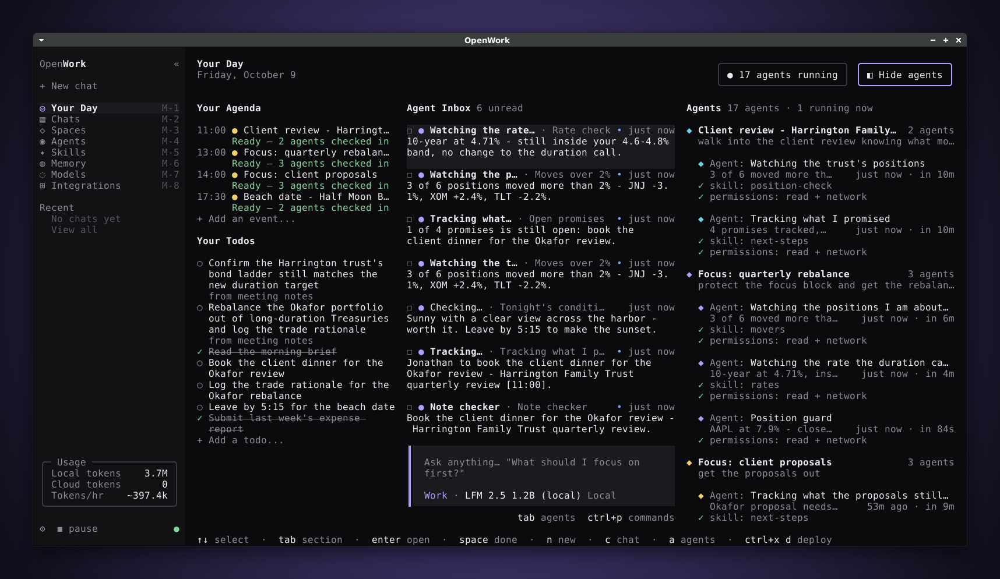](docs/openwork/README.md)

<p align="center"><sub>Alle skjermbildene her er det ekte OpenWork-TUI-et i xfce4-terminal på Linux (Xfce, Greybird-tema), med demo-arbeidsområdet og en frakoblet modell.</sub></p>

---

### Hva er OpenWork?

OpenWork gjør terminalgrensesnittet til opencode til et sted å få gjort arbeid — ikke bare kode. Beskriv en oppgave i én setning, for eksempel _“check the Half Moon Bay cam every 10m and tell me if it's sunny”_, og OpenWork ruller ut en agent i en lokal mappe du velger. Agenten kjører etter timeplanen sin i bakgrunnen, uten tilsyn, og alt den finner havner på ett sted: **Your Day**, ved siden av kalenderen din, gjøremålene dine og **Agent Inbox**.

Det er fortsatt en terminalapp og kjører fortsatt på opencode-harnessen: de samme øktene, verktøyene, tillatelsene, leverandørene, lokale modellene, skills og MCP-serverne. Agenter, kjøringer, innboks, gjøremål, kalender og minne lagres lokalt i SQLite.

### Høydepunkter

- **Utrulling på sekunder** — én setning → mappe → space → timeplan → tilgang. Trykk enter i hvert steg, og agenten er rullet ut og kjører på sekunder.
- **Timeplaner med vanlige ord** — på engelsk eller portugisisk: `every 10m`, `hourly`, `every morning at 8`, `daily at 7:30`, `at 5pm`, `now`, `a cada 15 minutos`, `todo dia às 8h`.
- **Your Day** — kalender, gjøremål, Agent Inbox og alle agenter gruppert etter space, med siste resultat og neste kjøring.
- **Agent Calendar** — alle dagens kjøringer i rekkefølge, farget etter space, med zoom fra noen minutter til hele dagen, og kjøringen som jobber akkurat nå markert med ramme.
- **Uten tilsyn og trygt** — kjøringer stopper aldri for å spørre: alt som ville vist en tillatelsesforespørsel, avvises. Hver agent har et tilgangsnivå: `read + network`, `read + write + network` eller `full`.
- **Ekte transkripsjoner** — hver kjøring er en ekte opencode-økt du kan åpne, med verktøykall, tokens og kostnad.
- **Agenter som rapporterer** — cowork-verktøyene `inbox`, `user_todo`, `agenda`, `memory` og `deploy` lar agenter skrive i innboksen din, legge til gjøremål, lese kalenderen din og huske fakta om deg. En chat kan rulle ut nye agenter.
- **Spaces** — samle agenter rundt et mål, en hendelse eller en kunde.
- **Minne** — fakta om deg som hver chat og hver agent får.
- **Token-statistikk** — lokale og sky-tokens telt hver for seg, forbrukstakt, en dagsprognose og hva lokale modeller sparer deg for.
- **Tastatur og mus** — `alt+1` … `alt+8` for sidene og `ctrl+p` for alle kommandoer; klikk på navigasjon, knapper, rader, avkrysningsbokser og tastetips; rull lister og kalenderen med hjulet.
- **ASCII hele veien** — logoen, målerne og smultringdiagrammene er tegnet med terminalens blokktegn.

### Skjermbilder

<table>
  <tr>
    <td width="50%" align="center">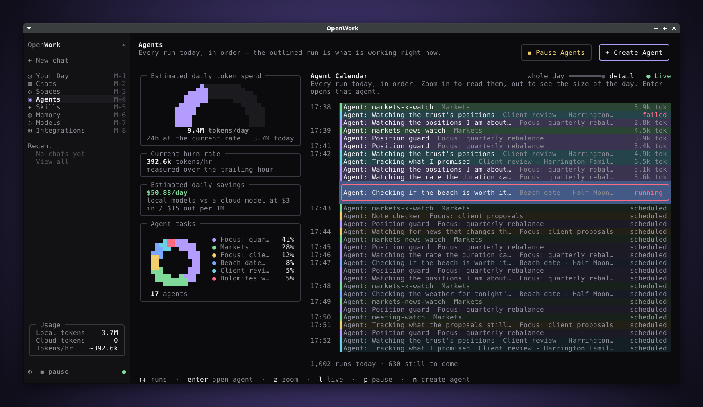<br><b>Agents</b> — token-måler, forbrukstakt, besparelser og den levende Agent Calendar</td>
    <td width="50%" align="center">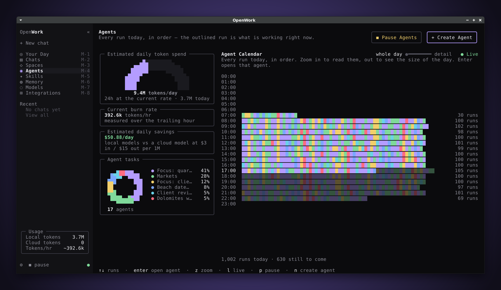<br><b>Agent Calendar</b> zoomet ut til hele dagen</td>
  </tr>
  <tr>
    <td width="50%" align="center">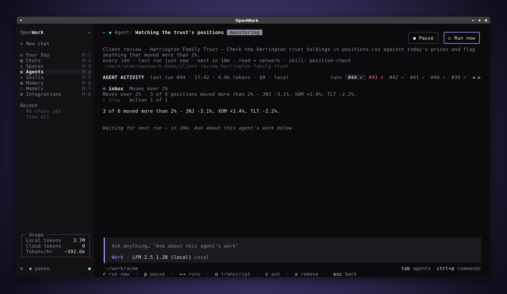<br><b>Agent</b> — verktøykall og resultat fra siste kjøring</td>
    <td width="50%" align="center">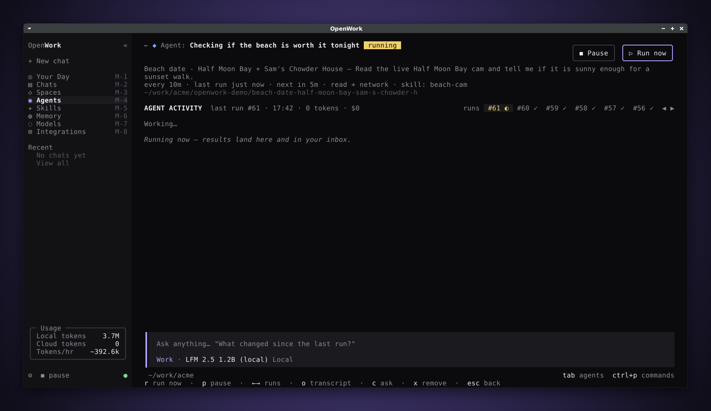<br>En agent som <b>kjører</b> akkurat nå</td>
  </tr>
  <tr>
    <td width="50%" align="center">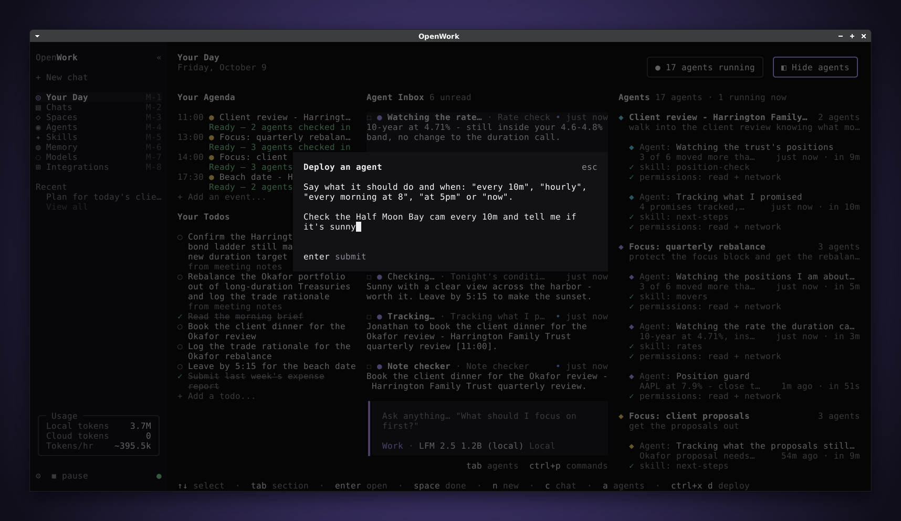<br><b>Rull ut</b> en agent med én setning</td>
    <td width="50%" align="center">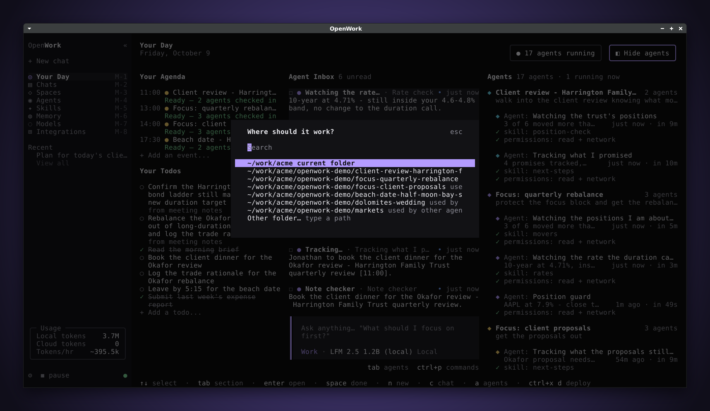<br>…og velg så <b>mappen</b> den jobber i</td>
  </tr>
  <tr>
    <td width="50%" align="center">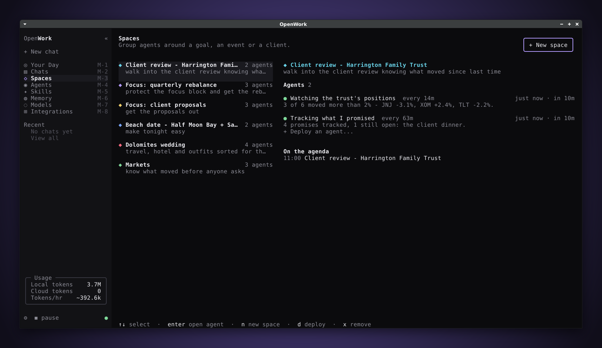<br><b>Spaces</b> — agenter samlet rundt et mål</td>
    <td width="50%" align="center">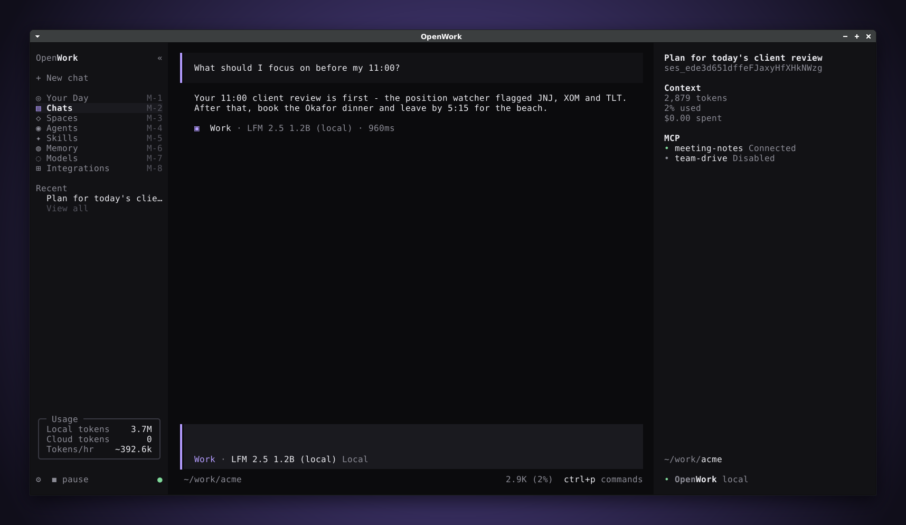<br>En <b>chat</b> med agenten <code>work</code>, inne i skallet</td>
  </tr>
  <tr>
    <td width="50%" align="center">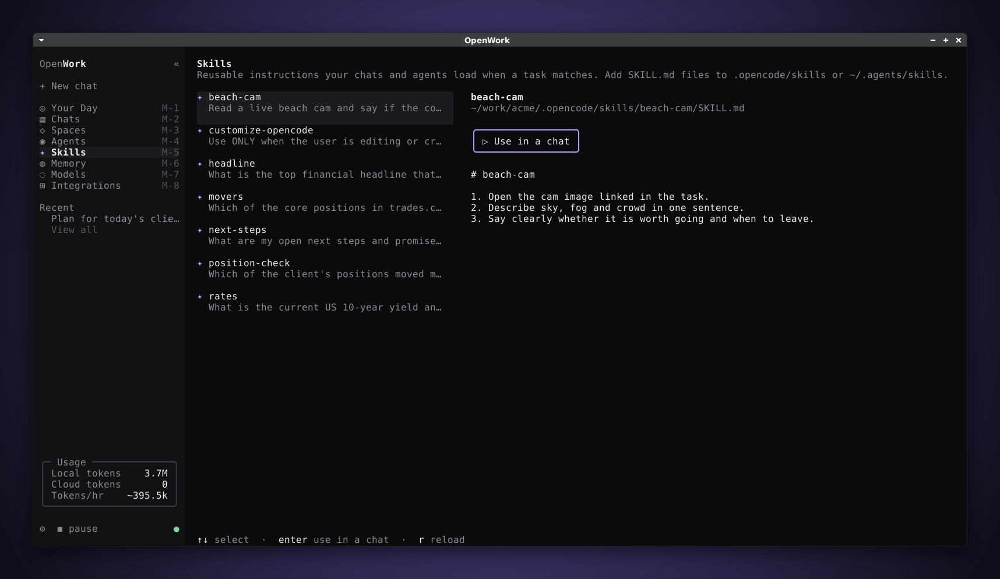<br><b>Skills</b> — gjenbrukbare instruksjoner</td>
    <td width="50%" align="center">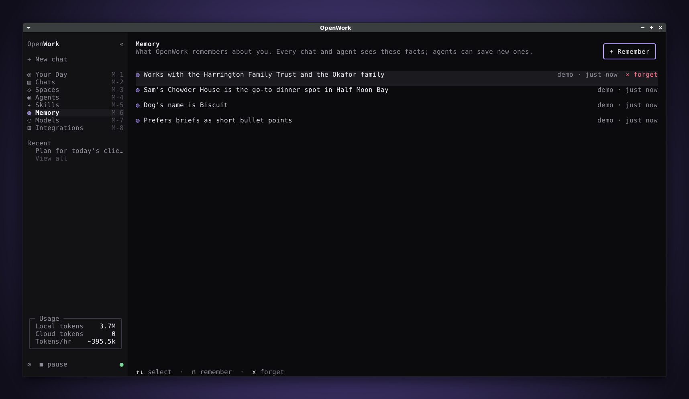<br><b>Memory</b> — hva hver chat og agent vet om deg</td>
  </tr>
  <tr>
    <td width="50%" align="center">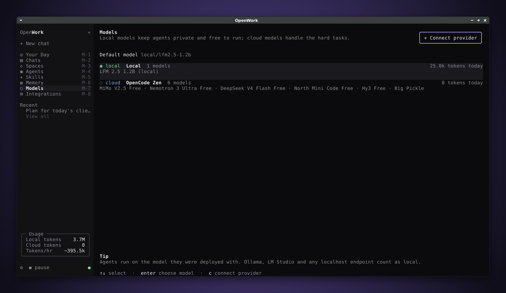<br><b>Models</b> — lokale og i skyen</td>
    <td width="50%" align="center">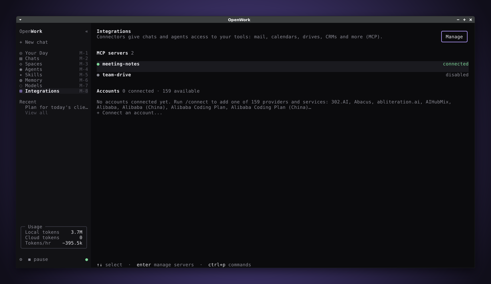<br><b>Integrations</b> — MCP-servere og kontoer</td>
  </tr>
  <tr>
    <td width="50%" align="center">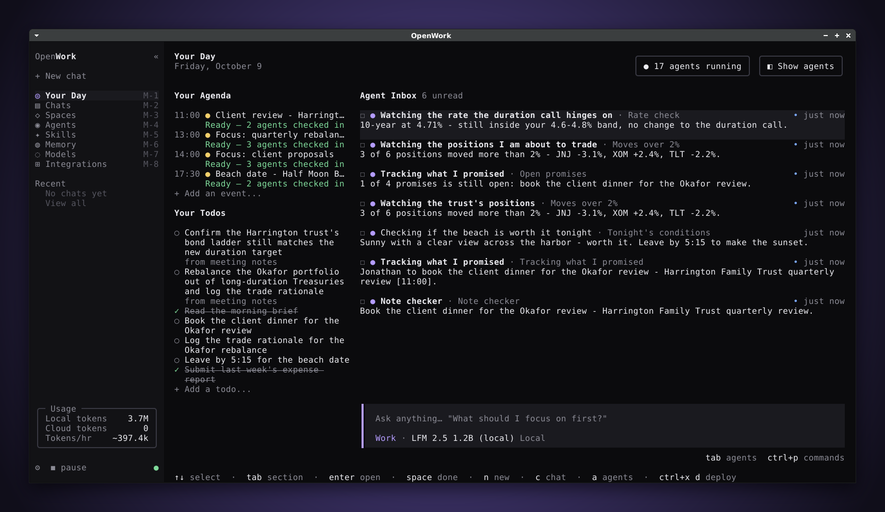<br><b>Your Day</b> med agentkolonnen skjult</td>
    <td width="50%" align="center">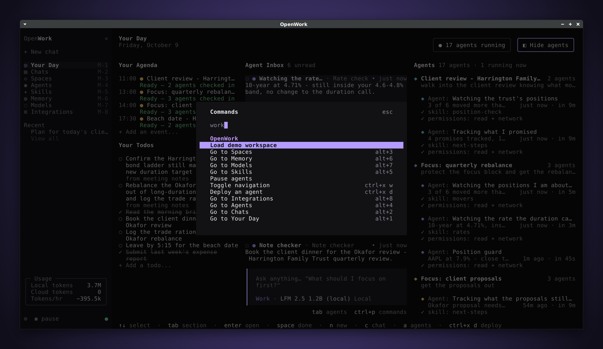<br>Alle <b>kommandoer</b> i paletten (<code>ctrl+p</code>)</td>
  </tr>
  <tr>
    <td width="50%" align="center">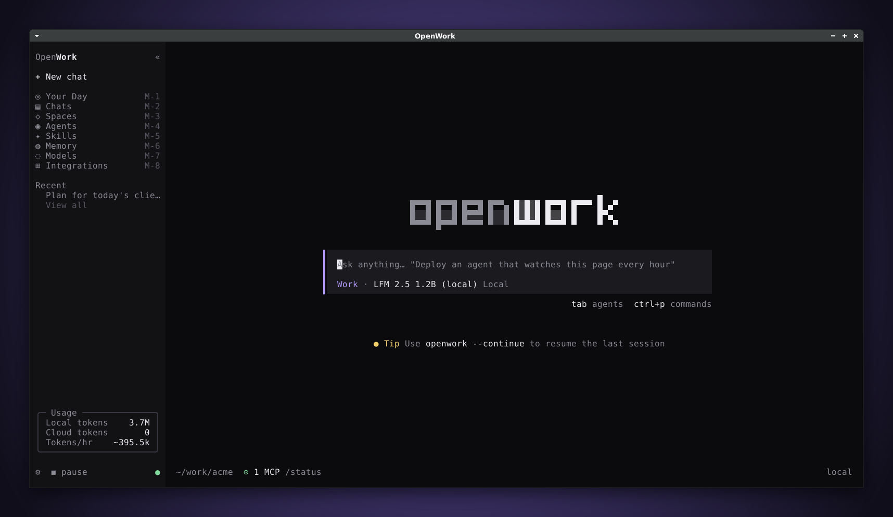<br><b>New chat</b></td>
    <td width="50%" align="center">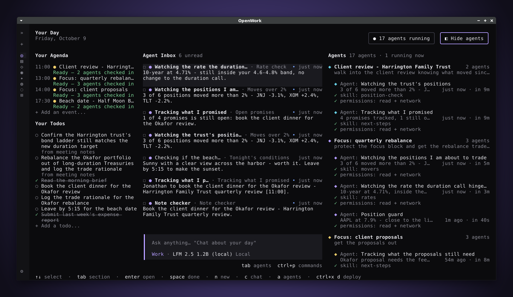<br>Sammenslått <b>navigasjon</b> (<code>ctrl+x w</code>)</td>
  </tr>
</table>

---

### Kom i gang

**Krav:** [Bun](https://bun.sh) 1.3 eller nyere, git og en terminal med truecolor og musestøtte (xfce4-terminal, GNOME Terminal, Konsole, kitty, WezTerm, Ghostty, iTerm2, Windows Terminal…). For modeller: enhver leverandør opencode støtter, eller en lokal modell via Ollama, LM Studio, llama.cpp eller vLLM.

#### Kjør fra kildekoden

```bash
git clone https://github.com/dedeprogames-official/openwork.git
cd openwork
bun install
bun dev ~/work        # mappen OpenWork åpner i
```

`bun dev .` åpner gjeldende mappe; `bun dev` alene åpner `packages/opencode`.

#### Bygg en frittstående binærfil

```bash
./packages/opencode/script/build.ts --single
./packages/opencode/dist/opencode-linux-x64/bin/opencode    # eller opencode-darwin-arm64, …
```

Pakken installerer den samme binærfilen både som `opencode` og som `openwork`.

#### Dine første fem minutter

1. **Koble til en modell** — `/connect`, eller åpne **Models** (`alt+7`) og trykk `c`. Se [Lokale modeller](#local-models) for lokale modeller.
2. **Last inn demoen** — `/demo` lager 6 spaces, 17 agenter, en dags kjørehistorikk, skills, meldinger i innboksen, gjøremål og en kalender. Agentene starter på pause, så ingenting bruker tokens; `/pause` lar dem kjøre.
3. **Rull ut din egen** — `ctrl+x d`, eller skriv `/deploy check the weather in Lisbon every morning at 7 and tell me if I need an umbrella` (timeplanen på engelsk eller portugisisk; oppgaven på hvilket som helst språk).
4. **Les Your Day** — `alt+1`. Resultatene havner i Agent Inbox; åpne en agent for å se kjøringene den har gjort eller chatte om arbeidet.

### Rull ut agenter

En agent er en oppgave, en mappe å jobbe i, en timeplan og et tilgangsnivå, og eventuelt en skill. Den kjører på modellen som var valgt da du rullet den ut. Rull ut med `ctrl+x d`, `/deploy <hva og når>`, knappen **+ Create Agent** på siden Agents, fra et space eller ved å be om det i en chat.

| Du skriver                                                              | Timeplan                                                              |
| ----------------------------------------------------------------------- | --------------------------------------------------------------------- |
| `every 10m`, `every 2 hours`, `a cada 15 minutos`                       | hvert N. minutt, time eller døgn (minst 1 minutt)                     |
| `hourly`, `every hour`, `every minute`                                  | hver time eller hvert minutt                                          |
| `daily at 9am`, `every morning at 8`, `every evening`, `todo dia às 8h` | hver dag på det tidspunktet (morgen 08:00, kveld 18:00, ellers 09:00) |
| `at 5pm`, `às 17h`                                                      | én gang, neste gang klokka er 17:00                                   |
| `now`, `once` — eller ingen tidsord i det hele tatt                     | én gang, med en gang                                                  |

Timeplansteget tilbyr også **on demand**: agenten kjører bare når du trykker **Run now**.

| Tilgang                  | Agenten kan                                          |
| ------------------------ | ---------------------------------------------------- |
| `read + network`         | lese filer, bruke nettet, skrive i innboksen din     |
| `read + write + network` | også opprette og redigere filer i mappen sin         |
| `full`                   | bruke alle verktøy du tillater, også skallkommandoer |

Kjøringer er uten tilsyn: spørsmål og alt som ville vist en tillatelsesforespørsel, avvises, og en kjøring stopper etter 15 minutter. Hver kjøring er en økt som heter `<agent> · run #N`; trykk `o` på agentens side for å åpne transkripsjonen.

### Sider

| Side         | Tast    | Viser                                                                                                            |
| ------------ | ------- | ---------------------------------------------------------------------------------------------------------------- |
| Your Day     | `alt+1` | Kalender, gjøremål, Agent Inbox, en chat-prompt og alle agenter gruppert etter space med siste og neste kjøring. |
| Chats        | `alt+2` | Chattene dine; agentkjøringer holdes utenfor listen.                                                             |
| Spaces       | `alt+3` | Spaces med agentene og kalenderpunktene sine.                                                                    |
| Agents       | `alt+4` | Token-måler, forbrukstakt, besparelser, hvor tokens går, og Agent Calendar.                                      |
| Agent        | `enter` | Én agent: oppgave, timeplan, tilgang, verktøykall og resultat for hver kjøring, historikk og dens egen chat.     |
| Skills       | `alt+5` | Skills fra `.opencode/skills` og `~/.agents/skills`.                                                             |
| Memory       | `alt+6` | Hva chatter og agenter vet om deg.                                                                               |
| Models       | `alt+7` | Lokale og sky-modeller; lokale tokens telles for seg i Usage-kortet.                                             |
| Integrations | `alt+8` | MCP-servere og tilkoblede kontoer.                                                                               |

### Tastatur og mus

| Taster            | Handling                             |
| ----------------- | ------------------------------------ |
| `alt+1` … `alt+8` | bytt side                            |
| `ctrl+x d`        | rull ut en agent                     |
| `ctrl+x w`        | slå sammen eller utvid navigasjonen  |
| `ctrl+p`          | kommandopalett                       |
| `c`               | fokuser chat-prompten (`esc` går ut) |
| `esc`             | tilbake                              |

Hver side viser sine egne taster nederst. Skråstrek-kommandoer: `/day`, `/chats`, `/spaces`, `/agents`, `/skills`, `/memory`, `/models`, `/integrations`, `/deploy <tekst>`, `/pause`, `/demo`, `/connect`.

Alt fungerer også med musen: klikk på navigasjonen, knappene og tastetipsene; i lister velger første klikk en rad, og andre klikk åpner den; avkrysningsbokser skifter med en gang; hjulet ruller lister og Agent Calendar. Dra markerer og kopierer fortsatt tekst.

<a id="local-models"></a>

### Lokale modeller

Enhver OpenAI-kompatibel server på `localhost` regnes som lokal, i likhet med leverandørene `ollama`, `lmstudio`, `llamacpp` og `vllm`. For eksempel med Ollama, i `opencode.json` (i mappen din eller i `~/.config/opencode/`):

```json
{
  "$schema": "https://opencode.ai/config.json",
  "provider": {
    "ollama": {
      "npm": "@ai-sdk/openai-compatible",
      "name": "Ollama",
      "options": { "baseURL": "http://localhost:11434/v1" },
      "models": { "qwen3:8b": { "name": "Qwen3 8B" } }
    }
  },
  "model": "ollama/qwen3:8b"
}
```

### Slik fungerer det

- Planleggeren bor i OpenWork-serverprosessen. Den ser etter agenter som skal kjøre hvert 5. sekund og kjører opptil 3 samtidig. Reservasjoner er atomære i SQLite, så flere OpenWork-vinduer kjører aldri samme agent to ganger, og kjøringer etterlatt av et krasj merkes som avbrutt. `OPENCODE_DISABLE_WORK_SCHEDULER=1` slår den av.
- Hver kjøring er en opencode-økt med agenten `work` — en kunnskapsarbeider-persona der mapper er arbeidsområder og filer er leveranser — med minnet ditt og agentens siste resultater i systemkonteksten, og tillatelser uten tilsyn for tilgangsnivået.
- OpenWork beholder opencode-konfigurasjonen: `opencode.json`, `.opencode/`, `OPENCODE_*`-variabler, leverandører, MCP-servere og skills fungerer som før.

| Hvor                                                    | Hva                                                             |
| ------------------------------------------------------- | --------------------------------------------------------------- |
| `packages/schema/src/work.ts`                           | poster, input og hendelsen `work.updated`                       |
| `packages/core/src/work.ts`, `packages/core/src/work/`  | SQLite-tabeller, `Work`-lageret og tolking av timeplaner        |
| `packages/opencode/src/work/`                           | planlegger, tillatelser uten tilsyn, kjørekontekst, demo        |
| `packages/opencode/src/tool/`                           | verktøyene `inbox`, `user_todo`, `agenda`, `memory` og `deploy` |
| `packages/opencode/src/server/routes/instance/httpapi/` | HTTP-API-et `/work/*`                                           |
| `packages/tui/src/work/`                                | skallet, navigasjonen, sidene og utrullingsdialogen             |

Den fullstendige veiledningen ligger i [docs/openwork](docs/openwork/README.md).

### Utvikling

```bash
bun install
bun dev ~/work

# sjekker kjøres fra en pakkemappe, aldri fra roten av repoet
(cd packages/tui && bun typecheck && bun test)
(cd packages/opencode && bun typecheck && bun test test/work)
```

Skjermbildene lages fra det ekte TUI-et med en frakoblet modell. Med `--window linux` er hvert bilde et foto av et ekte X11-vindu (Xvfb, vindusbehandleren xfwm4 og xfce4-terminal):

```bash
sudo apt-get install tmux python3-pil xvfb dbus-x11 xfwm4 xfce4-terminal greybird-gtk-theme xdotool imagemagick fonts-dejavu-core
cd packages/opencode
TZ=Europe/London bun script/openwork/screenshots.ts --window linux --out ../../docs/openwork/screenshots
```

Velg en `TZ` der det er sen ettermiddag: demoens kjørehistorikk starter kl. 06:00 lokal tid.

### Takk og lisens

OpenWork er bygget på [opencode](https://github.com/anomalyco/opencode) og beholder [MIT-lisensen](LICENSE). Det er ikke laget av opencode-teamet og er ikke tilknyttet dem. Bidrag er velkomne — se [CONTRIBUTING.md](CONTRIBUTING.md).
