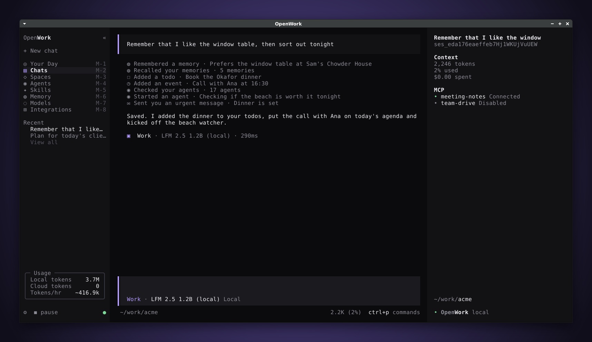

# OpenWork

OpenWork turns the opencode terminal UI into a work mode: you deploy agents into local folders, they run on a
schedule in the background, and everything they find lands in one place — **Your Day**. It is still a terminal app
and still runs on the opencode harness (same sessions, tools, permissions, providers and MCP servers).


## Concepts

| Concept | What it is                                                                                                                                                                                   |
| ------- | -------------------------------------------------------------------------------------------------------------------------------------------------------------------------------------------- |
| Agent   | A deployment: a task, a local folder to work in, a schedule (`every 10m`, `hourly`, `daily at 7:30`, once, or on demand), an access level and optionally a skill and model.                  |
| Run     | One unattended execution of an agent. Each run is a real opencode session (`<agent> · run #N`) you can open as a transcript. Runs never ask questions: anything that would prompt is denied. |
| Space   | A group of agents around a goal, an event or a client, with its own color.                                                                                                                   |
| Inbox   | Where agents report back. Agents post with the `inbox` tool; you mark items read or done, delete them or clear the inbox.                                                                    |
| Todos   | Your own todo list. Agents can add items (for example "from meeting notes") with the `user_todo` tool.                                                                                       |
| Agenda  | A local agenda for today. Events link to a space, so Your Day shows how many of its agents already checked in.                                                                               |
| Memory  | Facts about you that every chat and agent gets in its system context. Saved from the Memory page or by agents with the `memory` tool.                                                        |
| Access  | `read` (read + network), `write` (read + write + network) or `full` (whatever the agent already allows).                                                                                     |

Chats use the new `work` agent: a knowledge-work persona (folders are workspaces, files are deliverables) that can use
the inbox, todo, agenda and memory tools and can **deploy other agents** with the `deploy` tool — "check the Half
Moon Bay cam every 10m and tell me if it's sunny" in a chat creates a scheduled agent. In the chat and on the agent page
each of these calls reads as one friendly line, such as "Remembered a memory · Dog is called Biscuit" or "Checked your
agents · 17 agents".

## Installing it

```bash
curl -fsSL https://github.com/dedeprogames-official/openwork/releases/latest/download/install | bash      # macOS, Linux
irm https://github.com/dedeprogames-official/openwork/releases/latest/download/install.ps1 | iex          # Windows PowerShell
npx https://github.com/dedeprogames-official/openwork/releases/latest/download/openwork-cli.tgz           # any OS with Node.js 18+
```

The installers put `openwork` in `~/.openwork/bin` (`%USERPROFILE%\.openwork\bin` on Windows) and add it to your PATH. The
npm package is a small launcher that downloads the binary for your platform from the same release on first use.
`openwork upgrade` updates either kind of install: the install script's binary is replaced in place, and an npm
install gets the newer launcher through `npm install -g` (its binary downloads right away, so the next start is instant).
OpenWork keeps its data in `~/.local/share/openwork` and its global config in `~/.config/openwork`, apart from any
opencode install, and `openwork upgrade` only ever installs OpenWork releases. When a newer release is out, Settings
(`ctrl+x o` or ⚙) shows it at the top of General with an **Update** button: OpenWork closes and runs
`openwork upgrade` in the same terminal.

## Running it from source

```bash
bun install
bun dev            # or: openwork once installed
```

Inside the TUI:

- `/demo` loads a demo workspace (6 spaces, 17 agents, a day of run history, skills) — agents start paused, `/pause`
  lets them run.
- `/deploy <what and when>` or `ctrl+x d` deploys an agent: description → folder → space → schedule → access.
  Pressing enter at every step deploys in seconds and runs it once right away.
- `alt+1` … `alt+8` switch pages, `ctrl+x w` collapses the navigation, `ctrl+p` lists every command.
- `m` on an agent's page moves it to another space (or out of its space); on the Spaces page, `m` or
  **+ Move an agent here...** moves an agent into the selected space. In a chat, the `deploy` tool's `move` action does
  the same ("move the beach agent to Beach date").
- Everything also works with the mouse, as in opencode: click the navigation, buttons and the key hints at the
  bottom of each page; in lists the first click selects a row and a click on the selected row opens it (like
  enter); checkboxes toggle at once; the wheel scrolls lists and the agent calendar; the calendar's zoom and Live
  controls are clickable. Dragging to select text still copies it instead of clicking.

The scheduler runs inside the opencode server process (3 runs at a time, claims are atomic so several processes
never run the same agent twice). Set `OPENCODE_DISABLE_WORK_SCHEDULER=1` to turn it off.

## What OpenWork keeps between restarts

Closing OpenWork (or a crash) loses nothing you would expect to come back:

- Chats, agents, spaces, runs, inbox, todos, agenda, memories and the paused state live in the database.
- An answer still streaming when OpenWork closed, and any question you sent while it was busy, are picked up again on
  the next start. Pressing esc to interrupt an answer is final and is never resumed.
- A run cut off the same way is marked "Interrupted" and reported in the Agent Inbox.
- Each chat keeps its own unsent draft, and OpenWork reopens the page or chat you were on.
- "Allow always" answers are saved per folder; Settings → Permissions lists them so you can forget one. They never
  widen what an unattended agent may do.
- Settings: the theme and every preference, the access and run-once defaults for new agents (also used when a chat
  deploys one), integrations you switched off, the chat agent you picked and the model chosen for each agent.

## Pages

| Page         | Shows                                                                                                                                |
| ------------ | ------------------------------------------------------------------------------------------------------------------------------------ |
| Your Day     | Agenda, todos, Agent Inbox, a chat prompt and every agent grouped by space with its last result and next run.                        |
| Chats        | Your chats (agent runs are kept out of the list).                                                                                    |
| Spaces       | Spaces with their agents and agenda items.                                                                                           |
| Agents       | Token gauge, burn rate, local-vs-cloud savings, a donut of where tokens go and the **Agent Calendar** of every run today (zoomable). |
| Agent        | One agent: task, schedule, access, the tool calls and result of each run, run history, and a chat bound to that agent.               |
| Skills       | Skills from `.opencode/skills` and `~/.agents/skills`.                                                                               |
| Memory       | What chats and agents know about you.                                                                                                |
| Models       | Local and cloud models; local tokens are counted separately in the Usage section of the sidebar.                                     |
| Integrations | MCP servers and connected accounts.                                                                                                  |

## Adding an integration

Integrations are MCP servers. You do not have to edit `opencode.json` to add one: open **Settings → Integrations** and
press **+ Add** (top right), or use **+ Add** / `n` on the Integrations page. OpenWork asks, one question at a time:

1. a name (letters, numbers, `-` and `_`; the server's tools are listed under it),
2. whether it is a **remote server** (a URL) or a **local command** (a program started on this computer),
3. the URL, or the command line (quotes keep words with spaces together),
4. optionally, headers (`Authorization: Bearer …`) or environment variables (`API_KEY=…`). Values are masked in the
   summary and never printed.

It is kept by OpenWork and connects at once in the folder that is open, without interrupting a chat or an agent that is
running. When OpenWork closes, it is written to the global `opencode.json` (comments in a `.jsonc` file are kept),
which stays the source of truth: from then on the file alone defines it, and editing or deleting it there works as
usual. If the file cannot be written (for example, it has a syntax error), the integration keeps working from
OpenWork's own storage and the write is retried the next time OpenWork opens or closes. **Settings → Integrations →
Remove an integration…** deletes one from both places.

## Screenshots

All screenshots are photos of a real Linux window — xfce4-terminal under the xfwm4 window manager (Greybird theme) on
a headless X server — showing the real TUI running against an offline model. They are regenerated with:

```bash
sudo apt-get install tmux python3-pil xvfb dbus-x11 xfwm4 xfce4-terminal greybird-gtk-theme xdotool imagemagick fonts-dejavu-core
cd packages/opencode
TZ=Europe/London bun script/openwork/screenshots.ts --window linux --out ../../docs/openwork/screenshots
```

Without `--window linux` the script renders the terminal contents itself (`ansi2png.py`), which only needs tmux and
Pillow. Pick a `TZ` where it is late afternoon when you run it: the demo's run history starts at 06:00 local time, so
the day only looks full later on.

|                                                            |                                                                          |
| ---------------------------------------------------------- | ------------------------------------------------------------------------ |
|                    |  |
|                        |                 |
|            |                        |
|                        |                                          |
|                          |                                      |
|                        |                                      |
|            |                             |
|  |                           |
|                    |                 |
|           |                                                                          |

## Releases

Pushing a tag such as `v0.1.0` runs `.github/workflows/openwork-release.yml`: it cross-compiles every target on Linux
with `packages/opencode/script/build.ts`, signs the macOS binaries ad hoc and smoke-tests them on a Mac, smoke-tests the
Windows binary, then `packages/opencode/script/openwork/release.ts` packages `openwork-<target>` archives, the install
scripts, the npm launcher (`openwork-cli.tgz`) and `SHA256SUMS` into the GitHub release. The same workflow can be run by
hand with a version.

## Architecture

- `packages/schema/src/work.ts` — records, inputs and the `work.updated` event.
- `packages/core/src/work.ts`, `packages/core/src/work/` — SQLite tables, the `Work` store and schedule math
  (`WorkSchedule.parse` understands English and Portuguese: "every 10m", "a cada 15 minutos", "todo dia às 8h").
- `packages/opencode/src/work/` — scheduler, unattended permissions, run prompt and system context, demo seed.
- `packages/opencode/src/tool/{inbox,user-todo,agenda,memory,deploy}.ts` — the cowork tools.
- `packages/opencode/src/server/routes/instance/httpapi/{groups,handlers}/work.ts` — the `/work/*` HTTP API.
- `packages/tui/src/work/` — the shell, navigation and pages.
