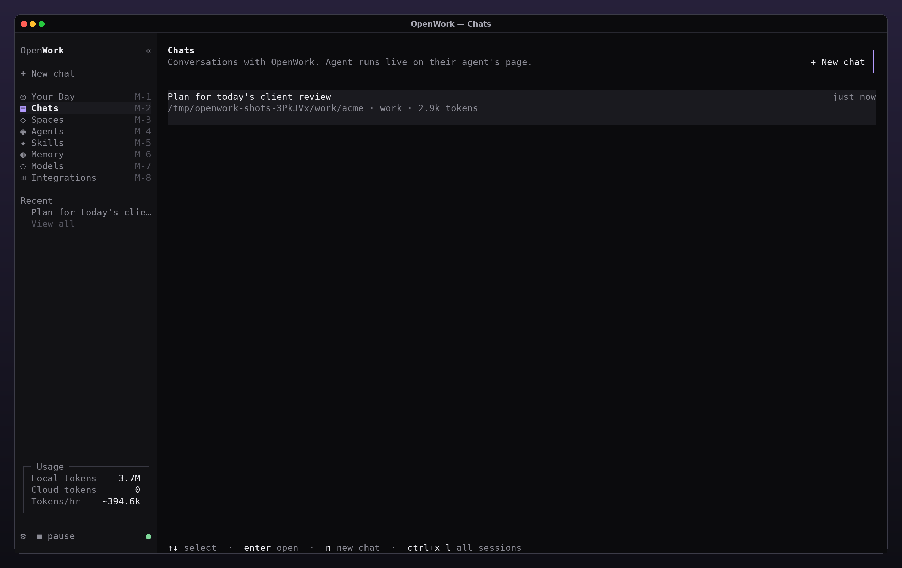

# OpenWork

OpenWork turns the opencode terminal UI into a work mode: you deploy agents into local folders, they run on a
schedule in the background, and everything they find lands in one place — **Your Day**. It is still a terminal app
and still runs on the opencode harness (same sessions, tools, permissions, providers and MCP servers).


## Concepts

| Concept | What it is                                                                                                                                                                                   |
| ------- | -------------------------------------------------------------------------------------------------------------------------------------------------------------------------------------------- |
| Agent   | A deployment: a task, a local folder to work in, a schedule (`every 10m`, `hourly`, `daily at 7:30`, once, or on demand), an access level and optionally a skill and model.                  |
| Run     | One unattended execution of an agent. Each run is a real opencode session (`<agent> · run #N`) you can open as a transcript. Runs never ask questions: anything that would prompt is denied. |
| Space   | A group of agents around a goal, an event or a client, with its own color.                                                                                                                   |
| Inbox   | Where agents report back. Agents post with the `inbox` tool; you mark items read or done.                                                                                                    |
| Todos   | Your own todo list. Agents can add items (for example "from meeting notes") with the `user_todo` tool.                                                                                       |
| Agenda  | A local agenda for today. Events link to a space, so Your Day shows how many of its agents already checked in.                                                                               |
| Memory  | Facts about you that every chat and agent gets in its system context. Saved from the Memory page or by agents with the `memory` tool.                                                        |
| Access  | `read` (read + network), `write` (read + write + network) or `full` (whatever the agent already allows).                                                                                     |

Chats use the new `work` agent: a knowledge-work persona (folders are workspaces, files are deliverables) that can use
the inbox, todo, agenda and memory tools and can **deploy other agents** with the `deploy` tool — "check the Half
Moon Bay cam every 10m and tell me if it's sunny" in a chat creates a scheduled agent.

## Running it

```bash
bun install
bun dev            # or: opencode / openwork once installed
```

Inside the TUI:

- `/demo` loads a demo workspace (6 spaces, 17 agents, a day of run history, skills) — agents start paused, `/pause`
  lets them run.
- `/deploy <what and when>` or `ctrl+x d` deploys an agent: description → folder → space → schedule → access.
  Pressing enter at every step deploys in seconds and runs it once right away.
- `alt+1` … `alt+8` switch pages, `ctrl+x w` collapses the navigation, `ctrl+p` lists every command.

The scheduler runs inside the opencode server process (3 runs at a time, claims are atomic so several processes
never run the same agent twice). Set `OPENCODE_DISABLE_WORK_SCHEDULER=1` to turn it off.

## Pages

| Page         | Shows                                                                                                                                |
| ------------ | ------------------------------------------------------------------------------------------------------------------------------------ |
| Your Day     | Agenda, todos, Agent Inbox, a chat prompt and every agent grouped by space with its last result and next run.                        |
| Chats        | Your chats (agent runs are kept out of the list).                                                                                    |
| Spaces       | Spaces with their agents and agenda items.                                                                                           |
| Agents       | Token gauge, burn rate, local-vs-cloud savings, a donut of where tokens go and the **Agent Calendar** of every run today (zoomable). |
| Agent        | One agent: task, schedule, access, the tool calls and result of each run, run history, and a chat bound to that agent.               |
| Skills       | Skills from `.opencode/skills` and `~/.agents/skills`.                                                                               |
| Memory       | What chats and agents know about you.                                                                                                |
| Models       | Local and cloud models; local tokens are counted separately in the Usage card.                                                       |
| Integrations | MCP servers and connected accounts.                                                                                                  |

## Screenshots

All screenshots are captures of the real TUI running against an offline model, regenerated with:

```bash
cd packages/opencode
TZ=Pacific/Kiritimati bun script/openwork/screenshots.ts --out ../../docs/openwork/screenshots
```

|                                                            |                                                                          |
| ---------------------------------------------------------- | ------------------------------------------------------------------------ |
|                    |  |
|                        |                 |
|            |                        |
|                        |                                          |
|                          |                                      |
|                        |                                      |
|            |                             |
|  |                           |
|                    |                 |

## Architecture

- `packages/schema/src/work.ts` — records, inputs and the `work.updated` event.
- `packages/core/src/work.ts`, `packages/core/src/work/` — SQLite tables, the `Work` store and schedule math
  (`WorkSchedule.parse` understands English and Portuguese: "every 10m", "a cada 15 minutos", "todo dia às 8h").
- `packages/opencode/src/work/` — scheduler, unattended permissions, run prompt and system context, demo seed.
- `packages/opencode/src/tool/{inbox,user-todo,agenda,memory,deploy}.ts` — the cowork tools.
- `packages/opencode/src/server/routes/instance/httpapi/{groups,handlers}/work.ts` — the `/work/*` HTTP API.
- `packages/tui/src/work/` — the shell, navigation and pages.
